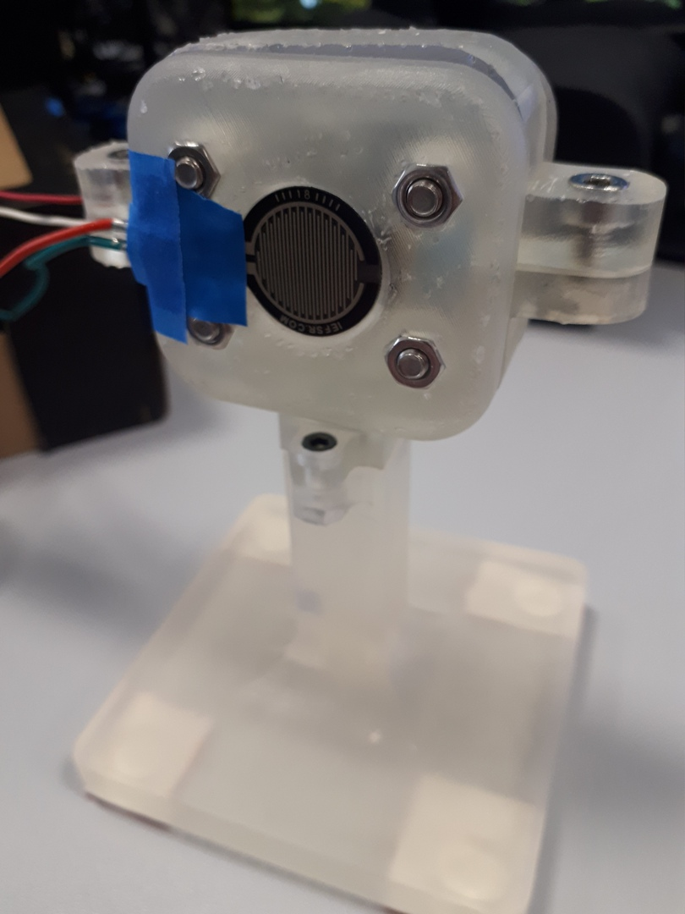
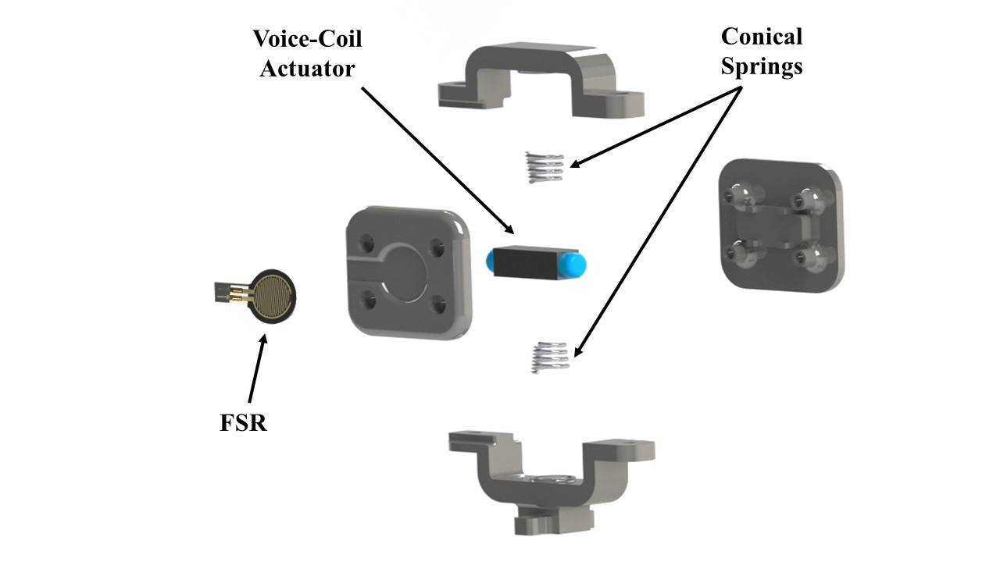
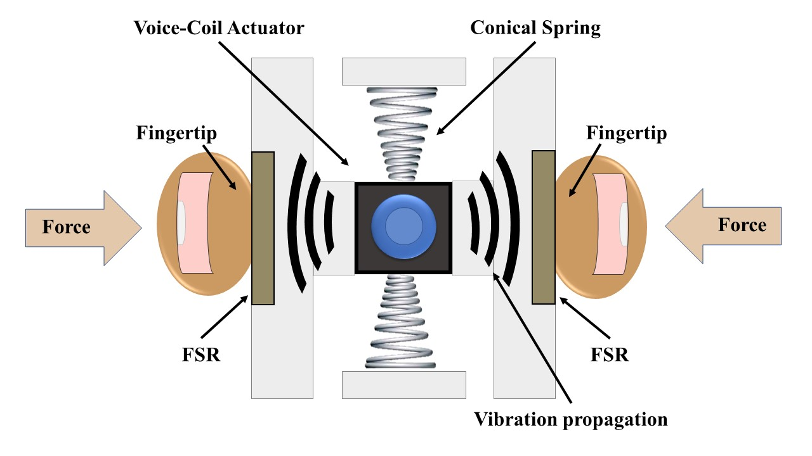

# Instruction for the Hardware Design

*Please read the Instructions for the Stimuli Strategy first.*

The enclosing structure of the device is a 3D printed from liquid polymer resin (Formlabs Clear Resin RS-F2-GPCL-04) plastic case in the form of the box on a leg as shown below:

To better understand the design ideas of this device, let's look on the schematics:

 

The FSR mounting parts are rigidly fastened to each other, with the actuator in-between, using four screws. Thus, the distance between the FSRs is constant (25 mm).
The connected FSR measures the applied normal force. This force modulates the oscillating frequency of the voice coil actuator (Fig. 2a). The actuator is vertically dual-pinned and mounted by conical springs. Therefore, the two side parts with FSRs on them are slightly movable with respect to the base of the haptic system. The springs isolate vibrations of the voice coil actuator from the base. This ensures that the most amount of vibrations propagates to the users’ fingertips through the side parts (Fig. 2b). Specifically, the fingertips are in contact with the housing of the voice-coil actuator not with the moving rod which was the case in [24] as the stimuli were applied with the rod by tapping over the skin. The motor coils were rigidly attached within an immovable 3D printed case. In our configuration, the stimuli are applied with the whole voice-coil linear actuator. Thus, it is important to keep the actuator movable – thanks to the springs – with respect to the case of the device.

