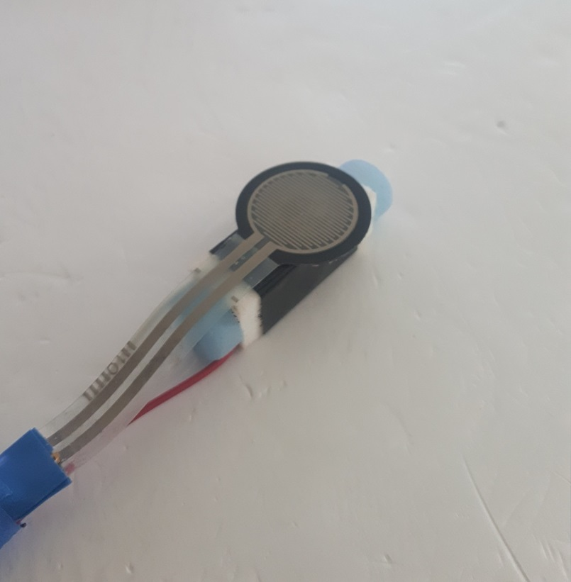
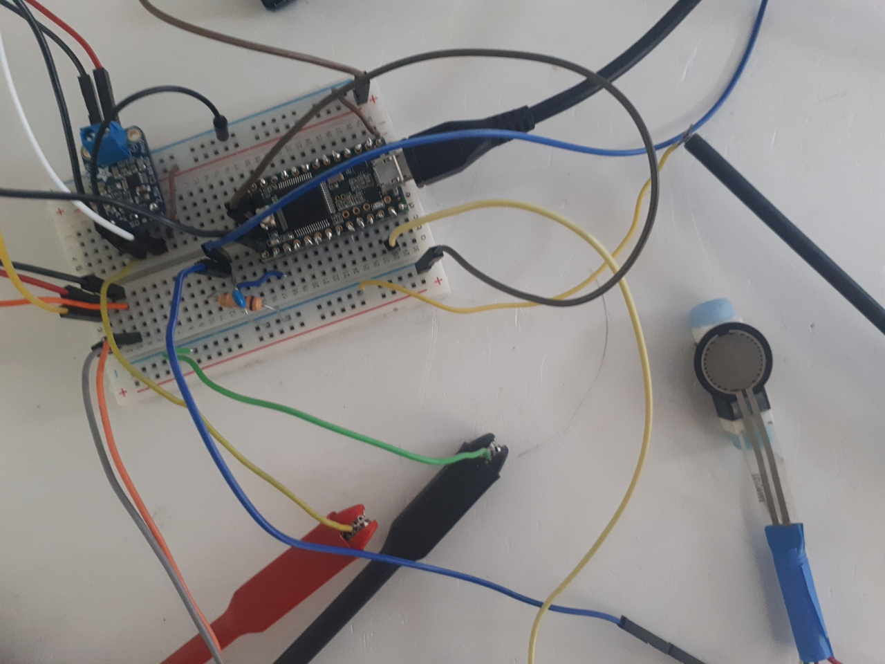
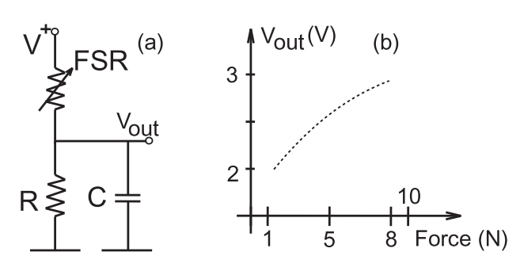
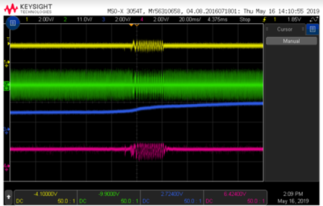
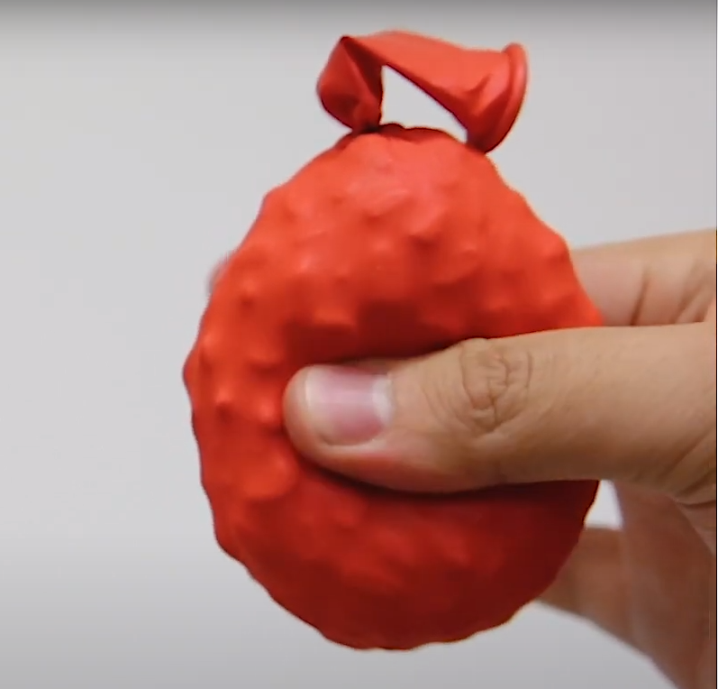
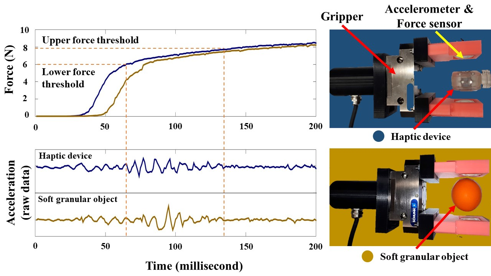
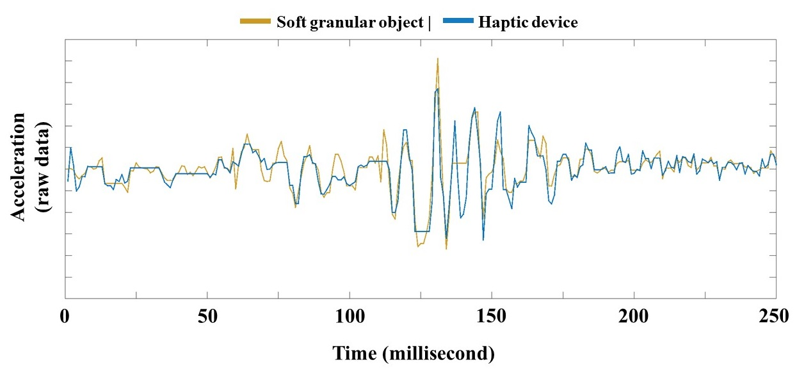
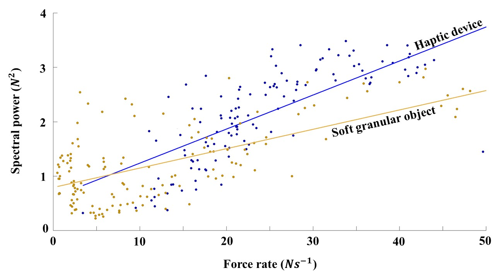

# Instruction for VibeRo's Stimulation Strategy

The aim of this project was to generate the haptic illusion of squeezing soft virtual objects. The process of creating the stimulation strategy and validation of results are described here in details. 

Firstly, we have to decide what does a softness of an object mean? What kind of tactile cues we perceive when interacting with soft objects? So, let's begin from the theory of touch and human tactile sensing. 

### 1. Theory 

From the article: 
> Human tactile perception consists of four types of mechanoreceptors, including fast adapting type I (FA-I), fast adapting type II (FA-II), slow adapting type I (SA-I) and slow adapting type II (SA-II), that provide information about physical interactions. SA-I and SA-II detect static forces due to the skin stretch. FA-I and FA-II detect changes at the points of contact, such as vibrations induced by slippage and other types of motions. Interestingly, FA-I and FA-II seem to be responsible for texture discrimination and slip detection. Inspired by this, the state-of-the-art VR controllers leverage voice-coil actuators to provide a more realistic perception of the VE by stimulating FA-I mechanoreceptors.

This mean that when touching a deformable object (soft objects are deformable) we can feel tiny distortions of the surface and inner structure. Here, we tried to reproduce this principle on a larger (visible) scale using a rubber bag filled with granular particles (e.g. coffee grains, salt and sugar). When squeezing this bag we could feel and see how the particles move inducing sound (“squeeze induced vibrations”). 

So, we set the goal - to generate similar vibrations using a haptic system. Voice coil actuator ([Haptuator Mark II, Tactile Labs]) has been chosen as the main actuation unit of our system. The reasons of this choice:
- large rated bandwidth (90-1000 Hz)
- easy control, compatibility with most audio amplifiers
- compact size (32x9x9 mm) and light weight (9.5g)
- energy efficiency

### 2. The math behind the stimuli

*!!! This section might be useful for understanding the code !!!*

Taking advantage of previous research on this topic [1], we've decided to provide tactile stimulus using the technique of vibrational frequency modulation by the rate of change of the applied force (by user's fingers during squeeze). Thus, the desired lateral displacement of the coil is 

where
-  is the frequency modulation coefficient 
-  is the amplitude 
-  is the normal force applied by user

For better understanding of why the frequency depends on the *rate of change* of the applied force (how fast a user squeezes an object), let's look at the equation above in details:

where 
- 
- 

These formulas has been interpreted as a code for the control board [Teensy 3.2]. The code is provided in this repository. 

### 3. Trying to reproduce realistic haptic sensations

At the beginning, we were trying to "pick up" appropriate values for coefficient  and thresholds for . At this stage, we were using pure actuator and force sensor (force sensing resistor (FSR), FSR 402, INTERLINK Electronics Inc.) without any casing.  

 

The system is powered by Teensy 3.2 development board that was chosen for its digital-to-analog converter (DAC) pin and compatibility with Arduino IDE software (Teensyduino). 
The analog output gives the possibility to drive the motor without any hand-written PWM generation. However, the output current of the DAC pin is too low to drive the motor on its full power. This problem can be solved with implementation of an audio-amplifier (class-D). We have used [this] amplifier for its lower low-pass filter corner frequencies. 

There is also additional tricks regarding FSR connection. The readout circuit based on a voltage divider configuration with a resistor R = 35 kOhm and filtering capacitor C = 200 nF. This sensor exhibits 10% hysteresis and non-linear response.

For now, there are no any other "hidden" device or circuit components - just follow datasheets of the mentioned components. 
When you are done with the this simple hardware circuit and uploaded the code to your board, you have to be sure that the input signals send to the actuator corresponds to your output singals that you send from the board. In other words, use the oscilloscope for measuring signals. In our approach, the oscilliscope has to show the following: 

where
- the blue signal - FSR values - the force applied by a user.
- other signals are of the same meaning - signals at DAC pin, the amplifier and the actuator.

In the figure above, it is clearly seen that the frequency of the output signal (actuator) depends on the rate of change of the input singal (force).

Using this simple system, we tried to get realistic sensation of squeezing a soft object. We compared the stimuli generated by the actuator to the tactile feeling perceived when squeezing a real soft object - a rubber ball filled with salt and soda. 

#### Summary:
- build a simple hardware first
- upload the code to the board
- try to get realistic sensations while tuning different parameters (both in the code and circuit components)

### 4. Tuning parameters

When you've got the same signals as shown on the oscilloscope and you're perceiving realistic tactile cues from your system, you can start developing the casing for your device to nicely embed the motor and force sensor. The design instructions are provided separately in the folder "Hardware Design". 

After finishing to assemble the device, continue to select proper parameters while comparing with real sensations because the vibrations from the bare actuator and vibrations from the actuator integrated to the plastic envelope and supported with springs differ due to the appearance of additional mechanical resistance (load). 

Finally, the parameters that we selected are:

|****|****|
|:-----------------------------------------------------------------------:|:-----------------------------------------------------------------------:|
| 0 (no vibration)                                                        |  4 on the code =  4.3 N                                                 |
| 2 (soft vibration)                                                      |  8 on the code =  8.2 N                                                 | 
| 5 (firm vibration)                                                      | 20 in the code = 12.9 N                                                 |  

### 5. Validation of the approach

In order to verify our feeling of similarity acquired with our tactile perception, we decided to quantitatively measure and analyze squeeze induced vibrations. Therefore, we used a robotic-gripper (SCHUNK EGN80, SCHUNK Gmbh & Co.) equipped with an accelerometer (ADXL335, Analog Devices Inc.). While the gripper was squeezing the haptic device and the balloon, accelerometer was recording the generated vibrations. 

In the figure above: 
The force (top) and vibrations (bottom) elicited when squeezing a soft granular object (blue line) and VibeRo (yellow line). Here we can see that both actuator and granular objects start to generate vibrations when the applied force reaches the lower threshold. 

In the figure above:
In order to compare these vibrations, the dynamic time warping (DTW) algorithm was used. It returns the distance, d∈R, d>0 between two time series. The distance is 0 for the identical time series. The figure illustrates the two time series of vibrations aligned by DTW algorithm resulting in d = 4.3. 

The signal power of both signals – that are plotted against the rate of normal force – increases with the force rate as depicted below:

The linear approximations (solid lines) in this figure highlight the similarity of the stimulus with the natural response of the granular object.

